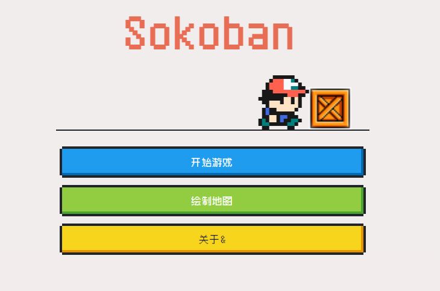

# Vue 3 + TypeScript + Vite 实现推箱子游戏



### 目前实现了双人推箱子功能

### Play1 通过  W A S D 进行操控人物

### Play2 通过 方向键  ↑ ↓ ←  → 操控人物

##### 初学前端用来练习，代码中有很多冗余地方，才疏学浅，不知道该怎么优化了。

##### 后续还想完成DIY地图的制作，可以用户自定义地图进行游戏

##### 目前完成了DIY地图的基础框架，后续的逻辑还没有编写。

#### 遗留还未开发的功能：

1、计分板的功能

2、首页按钮的路由跳转

3、整体UI的优化

启动项目：

```ssh
npm install
```

运行项目：

```ssh
npm run dev
```


